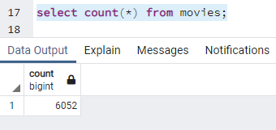
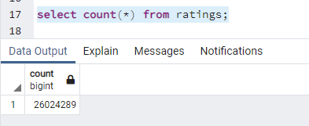

# Movies-ETL

The Movies-ETL project is an introduction to the ELT(Extract, Transform, Load) process. We used Movies data from Wikipedia & Kaggle to assemble a movie database from a clean dataset for a fictional hackathon.

The client asked for assistance in creating an automated pipeline that takes in new data, performs the appropriate transformations, and loads the data into existing tables. Python, Jupyter Notebook, and PostgreSQL were used for this project.

In this project we transform the datasets by cleaning rows and formatting datatypes, performing joins, and loading the cleaned dataset in a SQL database.

## Summary:
Data is extracted from the website in JSON and CSV formats.
JSON file requires extra step – loading file first and then transforming into data frame.
Data is transformed into Pandas data frames.
Ensure that data was loaded to an SQL database. Query 1 shows that the Movies Table has 6,052 rows and Query 2 shows that the Ratings Table has 26,024,286.

